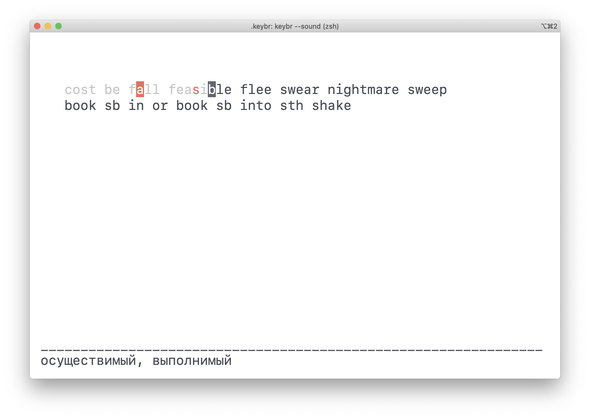

# keybr

**keybr** is an advanced console keyboard trainer with language learning support.
Just import your learning cards from [Anki](https://apps.ankiweb.net)
and then use them for touch typing training.
The app will track your typing speed and errors and choose phrases
for repeating to force learning process.
It also can read aloud current phrase.

I believe it's a good idea to learn how to write the words you are learning.
This app can help you to learn word spelling along with typing speed
of every specific word.
While you are training your typing speed you are also revising these word meanings.



## OS support

- macOS
- FreeBSD

Not tested but can be successfully built on others.

## Used libraries

- [ncurses](https://invisible-island.net/ncurses)
*(text-based UI library)*
- [sqlite3](https://www.sqlite.org)
*(relational database management system contained in a C library)*
- [libcurl](https://curl.haxx.se/libcurl)
*(multiprotocol file transfer library)*
- [ApplicationServices framework](https://developer.apple.com/documentation/applicationservices)
*(for Apple Speech Synthesis Manager)*
- [nlohmann/json](https://github.com/nlohmann/json)
*(header-only JSON parser for Modern C++)*
- [adishavit/argh](https://github.com/adishavit/argh)
*(header-only argument parser for Modern C++)*

## Installation

```bash
brew tap ivan-volnov/tap
brew install keybr
```

## Installation from source

```bash
git clone --recurse-submodules -j6 https://github.com/ivan-volnov/keybr.git
mkdir build
cd build/
cmake ..
make install
```

It installs into /usr/local/bin directory

The database file ~/.keybr/keybr.db will be created at the first launch

## Anki preparation

- Install [AnkiConnect](https://ankiweb.net/shared/info/2055492159) plugin
- Check your Note Type Fields. They must be **Front** and **Back**

## Configuration

Config file: ~/.keybr/config.json

```json
{
    "anki_query": "\"deck:Vocabulary Profile\" -is:new -is:learn -is:suspended",
    "anki_clear_query": "\"deck:Vocabulary Profile\"",
    "daily_goal": 10,
    "last_n_delay_revisions": 10,
    "max_current_errors": 5,
    "starting_symbol_delay_multiplier": 0.9,
    "total_phrases": 15,
    "uppercase_delay_multiplier": 0.4
}
```

Use [Anki Searching Query Language](https://docs.ankiweb.net/#/searching)
in anki_query and anki_clear_query parameters.
Before importing you can test the query in Anki's Browse screen

## Run options

```text
Usage: keybr [options]

Optional arguments:
-h --help               show this help message and exit
-S --stats              show stats and exit
-s --sound              read aloud the current phrase while typing
   --import             import cards from anki
   --clear_removed      remove cards that have been removed from anki deck
```

Press escape to exit
